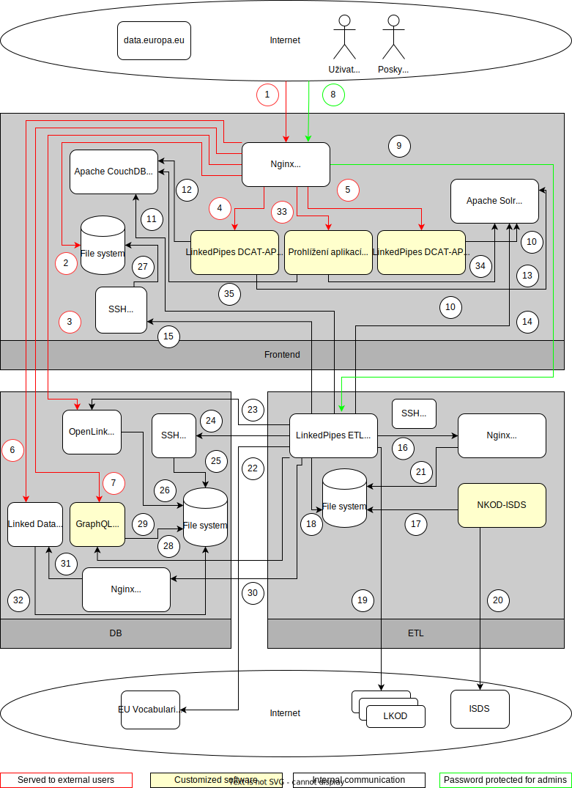

# Administrátorská dokumentace Národního katalogu otevřených dat
Národní katalog otevřených dat se skládá ze 7 propojených hlavních částí:
1. Prohlížeč datových sad ([LinkedPipes DCAT-AP Viewer])
2. Zadávací formuláře pro registraci datových sad a lokálních katalogů ([LinkedPipes DCAT-AP Forms])
3. Část zpracování dat z formulářů a harvestace lokálních katalogů ([LinkedPipes ETL])
4. Vyzvedávač datových zpráv z ISDS ([NKOD-ISDS])
5. Databáze pro dotazování nad metadaty a poskytování metadat Evropskému datovému portálu ([OpenLink Virtuoso Open-Source])
6. [Linked Data Fragments server]
7. [GraphQL server NKOD]

NKOD očekává, že jednotlivé harvestované lokální katalogy otevřených dat (LKODy) dodržují Otevřenou formální normu [Rozhraní katalogů otevřených dat: DCAT-AP-CZ].
Na [Portálu otevřených dat][POD] je dále popsána [Správa záznamů lokálních katalogů](https://opendata.gov.cz/cinnost:registrace-vlastniho-katalogu-v-nkod) a [Správa záznamů jednotlivých datových sad](https://opendata.gov.cz/cinnost:sprava-katalogizacniho-zaznamu-v-nkod).

## Přehled komponent a jejich komunikace
Komunikace jednotlivých částí je ilustrována v diagramu komunikace a popsána v této sekci (nakresleno v [diagrams.net](https://diagrams.net) - [zdroj](diagramy/communication.drawio.xml)).

1. Přístup přes protokoly HTTP a HTTPS. Využívají ho jak lidští uživatelé, tak aplikace přistupující na SPARQL, Linked Data Fragments a GraphQL endpointy nebo stahující dumpy.
2. Stahování dumpů s obsahem NKOD.
3. Přístup ke SPARQL endpointům, například pro [Oficiální portál evropských dat].
4. Přístup k prohlížeči datových sad (LinkedPipes DCAT-AP Viewer - LP-DAV).
5. Přístup k zadávacím formulářům (LinkedPipes DCAT-AP Forms - LP-DAF).
6. Přístup k Linked Data Fragments API NKOD.
7. Přístup k GraphQL API NKOD.
8. Zabezpečené přihlášení k frontendu LinkedPipes ETL (LP-ETL) pro monitorování běhu pipeline (přístup na nginx).
9. Zabezpečené přihlášení k frontendu LinkedPipes ETL (LP-ETL) pro monitorování běhu pipeline (komunikace s LP-ETL).
10. LinkedPipes DCAT-AP Forms používá Apache Solr pro autocomplete číselníků.
11. LinkedPipes ETL nahrávají do CouchDB číselníky pro LP-DAV a LP-DAF a záznamy pro jednotlivé datové sady pro LP-DAV.
12. LP-DAV načítá záznamy o detailech datových sad z Apache CouchDB.
13. LP-DAV využívá Apache Solr pro vyhledvání datových sad.
14. LP-ETL nahrává index a číselníky do Apache Solr.
15. LP-ETL nahrává přes SSH/SCP dumpy ke stažení (komunikace s SSH), navazuje 27 - uložení do filesystému.
16. LP-ETL si přes nginx vyzvedává externí číselníky a datové sady z cache.
17. NKOD-ISDS ukládá vyzvednuté datové zprávy do filesystému.
18. LP-ETL nahrává vyzvednuté datové zprávy a jejich metadata z filesystému. Naopak ukládá do cache externí datové sady a číselníky.
19. LP-ETL harvestuje jednotlivé lokální katalogy otevřených dat (LKODy).
20. NKOD-ISDS vyzvedává datové zprávy a jejich metadata z ISDS.
21. (nepoužito)
22. LP-ETL stahuje externí číselníky a datové sady do cache.
23. LP-ETL spouští nahrávací proces do databáze OpenLink Virtuoso nad soubory (26) skrz SQL, maže stávající obsah skrz HTTP.
24. LP-ETL nahrává skrz SSH/SCP soubory k nahrání do databáze OpenLink Virtuoso (komunikace s SSH).
25. LP-ETL nahrává skrz SSH/SCP soubory k nahrání do databáze OpenLink Virtuoso (uložení do filesystému).
26. OpenLink Virtuoso si vyzvedává soubory k nahrání z filesystému a nahrává je (na základě 23).
27. LP-ETL nahrává přes SSH/SCP dumpy ke stažení (uložení do filesystému), navazuje na 15 - komunikace s SSH.
28. LP-ETL signalizuje potřebu znovu nahrát data do GraphQL endpointu.
29. GraphQL endpoint nahrává data.
30. LP-ETL spouští v nginx webhook pro signalizaci potřeby znovu nahrát data do Linked Data Fragments serveru.
31. Webhook v nginx signalizuje Linked Data Fragments serveru potřebu znovu nahrát data.
32. Linked Data Fragments server nahrává data.

# Nasazení
Doporučený způsob nasazení vzhledem k minimalizaci vzájemného ovlivňování výkonu je na 3 oddělené stroje, pokud nepočítáme load-balancing a high-availability, což u NKOD zatím není potřeba:
1. **NKOD-DB**: Zde poběží samotná databáze, GraphQL endpoint a Linked Data Fragments endpoint.
2. **NKOD-ETL**: Zde poběží harvestace lokálních katalogů a transformace dat, vyzvedávání zpráv z ISDS a cache externích číselníků a datových sad (seznam OVM)
3. **NKOD-FRONTEND**: Zde poběží webový server, zadávací formuláře, prohlížeč datových sad, úložiště datových souborů ke stažení

V případě potřeby lze řešení nasadit i jiným způsobem.

## Databáze a dotazovací endpointy
Pro zpřístupnění metadat NKOD pro dotazování SPARQLem je použita databáze [OpenLink Virtuoso Open-Source].
Pro prohlížení RDF dat v HTML podobě je v databázi nainstalován balíček `fct`.
Po nasazení na NKOD-DB běží její HTTP endpoint na portu `8890`, její SQL endpoint na portu `1111` a má přístup do lokálního souborového systému (`/data/upload`).
HTTP SPARQL endpoint pro dotazování (`https://data.gov.cz/sparql`) a [SPARQL 1.1 Graph Store HTTP Protocol](https://www.w3.org/TR/sparql11-http-rdf-update/) endpoint pro dotazování (`https://data.gov.cz/sparql-graph-crud`), [GraphQL endpoint](https://data.gov.cz/graphql) a [Linked Data Fragments endpoint](https://data.gov.cz/ldf/) jsou veřejně přístupné přes reverse-proxy na NKOD-FRONTEND ([nginx](http://nginx.org/)).
Na NKOD-DB také běží SSH server, přes který jsou předávány RDF dumpy k nahrání do databáze.
SQL endpoint (`1111`) i celý HTTP endpoint (`8890`) včetně SPARQL endpointů pro zápis (`/sparql-auth` a `/sparql-graph-crud-auth`) jsou přístupné minimálně pro server NKOD-ETL.

### Postup instalace
V této sekci je popsán doporučený postup instalace databáze na stroji **NKOD-DB** s OS [Ubuntu](https://www.ubuntu.com/) 21.04 ze zdrojových kódů z GitHubu.

1. Openlink Virtuoso Open-Source
   1. Instalace
      1. Prerekvizity: `sudo apt-get install dpkg-dev build-essential autoconf automake libtool flex bison gperf gawk m4 make odbcinst libxml2-dev libreadline-dev net-tools`
      2. V adresáři `/opt`: Zdrojové kódy develop verze Virtuosa 
         1.`sudo git clone https://github.com/openlink/virtuoso-opensource.git -b develop/7`
         2.`sudo chown -R user:group virtuoso-opensource`
      3. `cd /opt/virtuoso-opensource`
      4. `./autogen.sh`
      5. `./configure --prefix=/usr/local/ --with-readline --program-transform-name="s/isql/isql-v/" --with-layout=Debian --enable-fct-vad`
      6. `make`
      7. `sudo make install`
   2. Konfigurace
      1. v `/etc/init.d/virtuoso-opensource` je [init script](skripty/nkod-db/virtuoso-opensource)
      2. Databáze je nakonfigurována tak, že její data jsou v `/data/virtuoso/db01`
      3. [Konfigurace](skripty/nkod-db/virtuoso.ini) je pak v `/data/virtuoso/db01/virtuoso.ini`
      4. Data pro upload budou v `/data/virtuoso/upload`
      5. Automatické spouštění po startu systému je zajištěno symlinkem na init script z `/etc/rc4.d`
      6. Je potřeba vytvořit uživatele `uploader`, který bude moci do `/data/virtuoso/upload` nahrávat data přes SSH/SCP
2. GraphQL endpoint
   1. Naklonovat do `/opt/nkod-graphql`
      1. V `/opt`: `sudo git clone https://github.com/opendata-mvcr/nkod-graphql.git`
      2. Vytvořit uživatele `graphql`: `sudo adduser graphql --disabled-login`
      3. Předat mu vlastnictví `sudo chown -R graphql:graphql nkod-graphql`
      4. Nainstalovat prerekvizity
         1. `sudo -u graphql bash`
         2. `npm ci`
   2. Zprovoznit jako `systemd` službu pomocí [`nkod-graphql.service`](skripty/nkod-db/service/nkod-graphql.service)
      - vyžaduje existenci NKOD JSON dumpu
3. Linked Data Fragments endpoint
   1. Běžným způsobem nainstalovat Node.js
   2. `npm install -g @ldf/server`
   3. Do `/opt/ldf-server` umístit [`config.json`](skripty/nkod-db/ldf-server/config.json)
   4. Zprovoznit jako `systemd` službu pomocí [`ldf-server.service`](skripty/nkod-db/service/ldf-server.service)
      - vyžaduje existenci NKOD HDT dumpu
4. Webhooky
   1. Běžným způsobem nainstalovat `nginx` a `php7.4-fpm`
      1. v `/etc/php/7.4/fpm/pool.d/www.conf` změnit uživatele `www-data` na `nginx`, pokud `nginx` běží pod uživatelem `nginx`
   2. Pomocí `sudo visudo` nastavit, aby uživatel `nginx` mohl signalizovat službě a restartovat Virtuoso
      1. `nginx ALL=(ALL) NOPASSWD: /usr/sbin/service`
      2. `nginx ALL=(ALL) NOPASSWD: /etc/init.d/virtuoso-opensource`
   3. Do `/data/www/deploy` umístit [PHP webhooky](skripty/nkod-db/hooks/)

##  Transformace dat
V této sekci je popsán doporučený postup instalace stroje **NKOD-ETL** s OS [Ubuntu](https://www.ubuntu.com/) 21.04.

### Prerekvizity
- [OpenJDK](https://jdk.java.net/16/) 16.0.2
- [Apache Maven](https://maven.apache.org/)
- [Git](https://git-scm.com/)
- [node.js](https://nodejs.org) 16.9.0
- [nginx](http://nginx.org/)
- [LinkedPipes ETL]
- Vyzvedávátko zpráv z ISDS [NKOD-ISDS]

### Postup instalace
1. Instalace LinkedPipes ETL [dle návodu](https://etl.linkedpipes.com/installation/)
   1. Přidán uživatel `lpetl`, pod kterým bude nástroj běžet
   2. `/opt/lp`: `git clone https://github.com/opendata-mvcr/etl.git`
      1. `cd etl`
      2. `mvn install`
    3. v `/opt/lp/etl/deploy/frontend`: `npm i`
2. Konfigurace LinkedPipes ETL
   1. konfigurační soubor `/opt/lp/etl/deploy/configuration.properties`, je třeba upravit dle použitých URL
   2. data budou v `/data/lp/etl/working`
   3. logy budou v `/data/lp/etl/logs`
   4. frontend běží na `localhost:8080`
3. LinkedPipes ETL jako služby
   1. [`/etc/systemd/system/lpetl-executor.service`](skripty/nkod-etl/service/lpetl-executor.service)
   2. [`/etc/systemd/system/lpetl-executor-monitor.service`](skripty/nkod-etl/service/lpetl-executor-monitor.service)
   3. [`/etc/systemd/system/lpetl-storage.service`](skripty/nkod-etl/service/lpetl-storage.service)
   4. [`/etc/systemd/system/lpetl-frontend.service`](skripty/nkod-etl/service/lpetl-frontend.service)
4. Nahrání [16x LP-ETL pipeline](pipeliny/README.md) a nastavení přístupových údajů v příslušných šablonách
5. nginx [zpřístupňuje](skripty/nkod-etl/nginx/localhost.conf) `/data/cache` pro přístup z `localhost`
6. Instalace NKOD-ISDS
   1. v `/opt`: `git clone https://github.com/opendata-mvcr/nkod-isds.git`
   2. v `/opt/nkod-isds`: `mvn install`
   3. konfigurační soubor v `/opt/nkod-isds/dist/configuration.properties`

##  Frontend
V této sekci je popsán doporučený postup instalace stroje **NKOD-FRONTEND** s OS [Ubuntu](https://www.ubuntu.com/) 21.04.

### Prerekvizity
- [OpenJDK](https://jdk.java.net/16/) 16.0.2
- [Git](https://git-scm.com/)
- [node.js](https://nodejs.org) 16.9.0
- [nginx](http://nginx.org/) 1.21.3
- certbot (letsencrypt.org) - pokud nebude jiný certifikát
- [Apache CouchDB](https://couchdb.apache.org/) 2.2.0
- [Apache Solr](http://lucene.apache.org/solr/) 8.7.0
- [LinkedPipes DCAT-AP Viewer]
- [LinkedPipes DCAT-AP Forms]

### Postup instalace
1. Běžným způsobem nainstalována Apache CouchDB, Apache Solr, OpenJDK, Node.js, nginx
2. Pro Apache Solr lze použít [návod pro zprovoznění](https://lucene.apache.org/solr/guide/8_7/taking-solr-to-production.html)
3. Instalace LinkedPipes DCAT-AP Forms
   1. zřídit uživatele `lpdaf`
   2. v `/opt/lp`: `git clone https://github.com/opendata-mvcr/dcat-ap-forms.git`
   3. dále dle [návodu](https://github.com/opendata-mvcr/dcat-ap-forms)
   4. Instalováno [jako služba](skripty/nkod-frontend/service/dcat-ap-forms.service) v `/etc/systemd/system/dcat-ap-forms.service`
4. Instalace LinkedPipes DCAT-AP Viewer
   1. zřídit uživatele lpdav
   2. v `/opt/lp`: `git clone https://github.com/opendata-mvcr/dcat-ap-viewer.git -b nkod`
   3. Dále dle [návodu](https://github.com/opendata-mvcr/dcat-ap-viewer)
   4. Instalováno [jako služba](skripty/nkod-frontend/service/dcat-ap-viewer.service) v `/etc/systemd/system/dcat-ap-viewer.service`
5. Je potřeba vytvořit uživatele `uploader`, který bude moci do `/data/soubor` nahrávat data přes SSH/SCP
6. nginx [reverse proxy na jednolivé části NKOD](skripty/nkod-frontend/nginx)
   1. Konfigurace v `/etc/nginx`
   2. Reverse-proxy na SPARQL endpoint NKOD-DB
   3. Reverse-proxy na GraphQL endpoint NKOD-DB
   4. Reverse-proxy na Linked Data Fragments endpoint NKOD-DB
   5. Reverse-proxy na LinkedPipes DCAT-AP Forms
   6. Reverse-proxy na LinkedPipes DCAT-AP Viewer
   7. Reverse-proxy na LinkedPipes ETL na NKOD-ETL (zabezpečeno alespoň heslem)

# Příprava
Před naplánováním stahování z ISDS a spouštění pipeline v LP-ETL je třeba systém inicializovat zejména externími číselníky a datovými sadami.
Je tedy třeba (nakonfigurovat a) spustit pipeliny v pořadí daném čísly.
Tedy:
1. [01 Cache externích zdrojů](pipeliny/01%20Cache%20externích%20zdrojů.jsonld) - stáhne evropské číselníky a použité pomocné dokumenty z Google Drive a z RÚIAN
2. [02 Seznam OVM](pipeliny/02%20Seznam%20OVM.jsonld) - stáhne aktuální datovou sadu Seznam OVM pro kontrolu datových schránek OVM
3. [03 Konverze záznamů z PVS do DCAT-AP](pipeliny/03%20Konverze%20záznamů%20z%20PVS%20do%20DCAT-AP.jsonld) - Provede úvodní transformaci původních dat ze starého NKOD do aktuálního formátu
4. [04 Nahrát externí data do SPARQL endpointu](pipeliny/04%20Nahrát%20externí%20data%20do%20SPARQL%20endpointu.jsonld) - Nahraje evropské číselníky do databáze
5. [05 Nahrát číselníky do Solr pro LP DCAT-AP Forms](pipeliny/05%20Nahrát%20číselníky%20do%20Solr%20pro%20LP%20DCAT-AP%20Forms.jsonld) - Nahraje evropské číselníky do Apache Solr pro LP-DAF
6. [06 Nahrát čísleníky do CouchDB pro LP DCAT-AP Viewer](pipeliny/06%20Nahrát%20čísleníky%20do%20CouchDB%20pro%20LP%20DCAT-AP%20Viewer.jsonld) - Nahraje evropské číselníky do Apache CouchDB pro LP-DAV
 
Pak lze v cronu na **NKOD-ETL** v `/etc/cron.d/nkod` naplánovat [spouštění NKOD-ISDS](skripty/nkod-etl/download.sh) a [pipeline](skripty/nkod-etl/harvest.sh) `07 Harvestace LKOD a formulářů, aktualizace uživatelského rozhraní` v LP-ETL.

# Monitoring
Je třeba zejména na **NKOD-ETL** monitorovat místo na disku, které může dojít kvůli velikosti logů, pokud bude v produkčním prostředí poddimenzována velikost disku.

[LinkedPipes DCAT-AP Viewer]: https://github.com/opendata-mvcr/dcat-ap-viewer "LinkedPipes DCAT-AP Viewer"
[LinkedPipes DCAT-AP Forms]: https://github.com/opendata-mvcr/dcat-ap-forms "LinkedPipes DCAT-AP Forms"
[LinkedPipes ETL]: https://github.com/opendata-mvcr/etl "LinkedPipes ETL"
[NKOD-ISDS]: https://github.com/opendata-mvcr/nkod-isds "NKOD-ISDS"
[OpenLink Virtuoso Open-Source]: https://github.com/opendata-mvcr/virtuoso-opensource "OpenLink Virtuoso Open-Source"
[Linked Data Fragments server]: https://github.com/opendata-mvcr/Server.js "Linked Data Fragments server"
[GraphQL server NKOD]: https://github.com/opendata-mvcr/nkod-graphql "GraphQL server NKOD"
[Rozhraní katalogů otevřených dat: DCAT-AP-CZ]: https://ofn.gov.cz/rozhraní-katalogů-otevřených-dat/2021-01-11/ "Otevřená formální norma Rozhraní katalogů otevřených dat: DCAT-AP-CZ"
[POD]: https://data.gov.cz "Portál otevřených dat"
[Oficiální portál evropských dat]: https://data.europa.eu "Oficiální portál evropských dat"