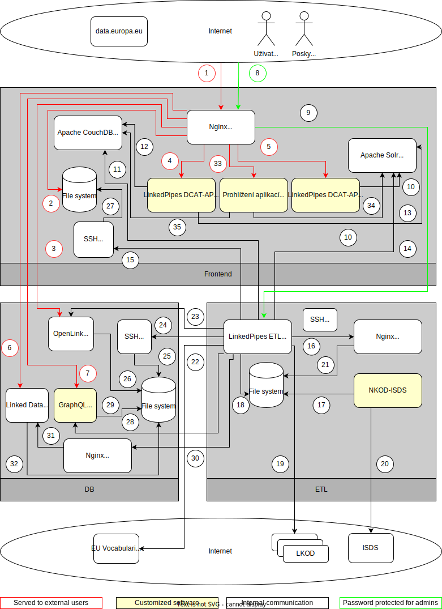
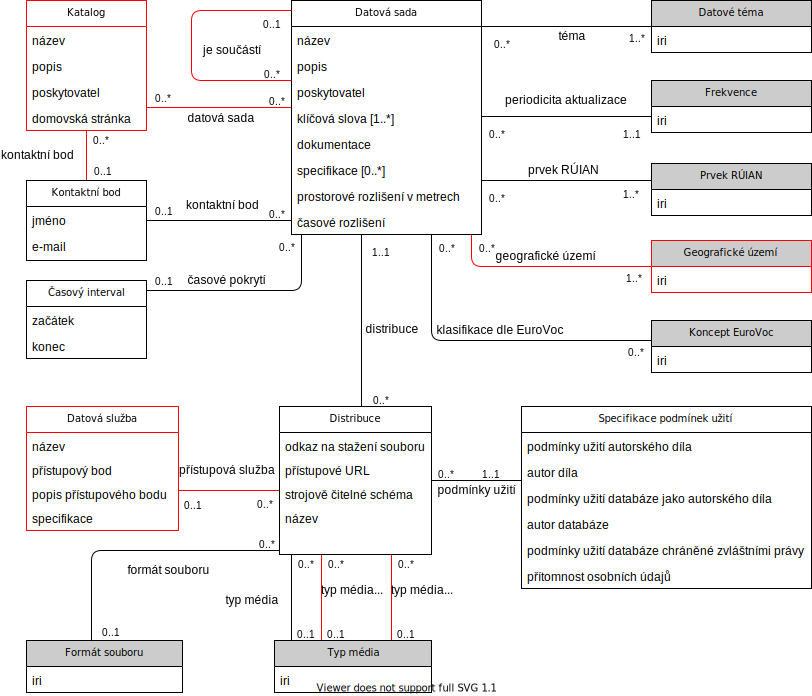
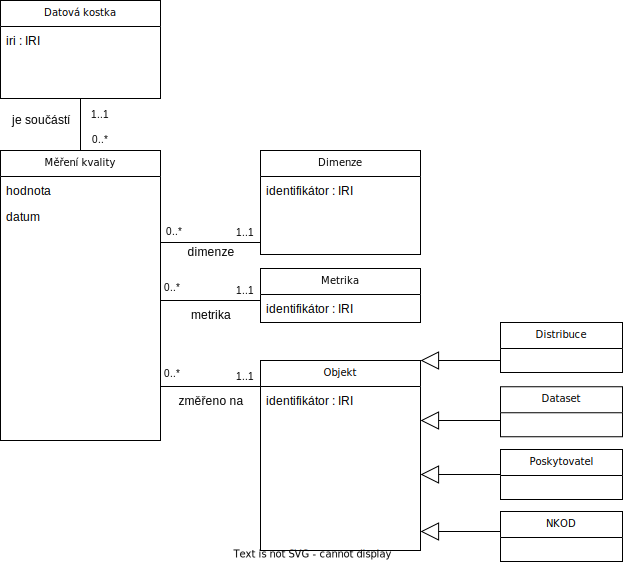

# Aplikační příručka Národního katalogu otevřených dat

## Seznam pojmů a zkratek

<dl>
    <dt>CORS</dt>
    <dd>Cross-Origin Resource Sharing</dd>
    <dt>DCAT-AP-CZ</dt>
    <dd>Otevřená formální norma "Rozhraní katalogů otevřených dat: DCAT-AP-CZ" založená na evropském standardu DCAT-AP, který je založen na webovém standardu DCAT</dd>
    <dt>DGA</dt>
    <dd>Data Governance Act - <a href="https://eur-lex.europa.eu/legal-content/CS/TXT/HTML/?uri=CELEX:32022R0868">Akt o správě dat</a></dd>
    <dt>ISDS</dt>
    <dd>Informační systém datových schránek</dd>
    <dt>LKOD</dt>
    <dd>Lokální katalog otevřených dat</dd>
    <dt>NKOD</dt>
    <dd>Národní katalog otevřených dat</dd>
    <dt>POD</dt>
    <dd>Portál otevřených dat</dd>
    <dt>RDF</dt>
    <dd>Resource Description Framework - datový model využívaný NKOD</dd>
    <dt>SPARQL</dt>
    <dd>Dotazovací jazyk nad daty v RDF</dd>
</dl>

## Popis funkcionality
Národní katalog otevřených dat (NKOD) obsahuje zejména databázi metadatových záznamů datových sad otevřených dat poskytovaných různými institucemi veřejné správy, která poskytuje [SPARQL endpoint] pro dotazování.
V databázi se zrcadlí metadataové záznamy datových sad registrovaných jednotlivě přímo v NKOD a záznamy pocházející z Lokálních katalogů otevřených dat (LKOD) provozovaných přímo poskytovateli dat.
Metadatové záznamy odpovídají specifikaci [Rozhraní katalogů otevřených dat: DCAT-AP-CZ]. 
Databáze NKOD je tvořena pravidelně denně.
Po každém vytvoření databáze NKOD je zhodnocena i kvalita metadatových záznamů vzhledem k DCAT-AP-CZ a dostupnost registrovaných zdrojů.
Na základě naměřených hodnot jsou vygenerovány reporty obsahující zjištěné skutečnosti.

Kromě datových sad otevřených dat NKOD obsahuje i datové sady Inventárního seznamu, což je seznam datových sad, ke kterým je třeba žádat o přístup dle DGA.
Datové sady inventárního seznamu jsou přítomny ve [SPARQL Endpoint], nejsou však viditelné v uživatelském rozhraní.
Slouží primárně pro harvestaci do [National Single Information Point (NSIP)] v rámci "European Register for Protected Data held by the Public Sector".

Kromě záznamů o datových sadách obsahuje NKOD i záznamy o aplikacích využívajících registrované datové sady a záznamy o požadavcích na datové sady k otevření.

Na vstupu tedy NKOD zajišťuje zpracování příchozích registrací z ISDS, následnou harvestaci metadat z LKOD, včetně registrace metadat přímo do NKOD, a také zpracovává registrace aplikací pracujících s otevřenými daty a požadavků na data k otevření.
Na základě těchto vstupů pak pravidelně nahránvá obsah NKOD do RDF databáze přístupné přes SPARQL endpoint, dále do Triple Pattern Fragments endpointu, GraphQL endpointu, vystavuje obsah NKOD v podobě souborů na webu, a nakonec také naplňuje databázi a indexy frontendové aplikace pro lidské uživatele, která obsahuje i registrační formuláře pro tvorbu registračních záznamů zasílaných pomocí ISDS.

NKOD je integrován do POD - portálu otevřených dat https://data.gov.cz, který také obsahuje informace pro poskytovatele a uživatele otevřených dat, školení a otevřené formální normy.
Tato dokumentace se dále zabývá pouze částí NKOD.

## Přehled komponent
Národní katalog otevřených dat se skládá ze 8 propojených hlavních částí:
1. Prohlížeč datových sad ([LinkedPipes DCAT-AP Viewer])
2. Prohlížeč registrovaných aplikací ([Aplikace])
3. Zadávací formuláře pro registraci datových sad a lokálních katalogů ([LinkedPipes DCAT-AP Forms])
4. Část zpracování dat z formulářů a harvestace lokálních katalogů ([LinkedPipes ETL])
5. Vyzvedávač datových zpráv z ISDS ([NKOD-ISDS])
6. Databáze pro dotazování nad metadaty a poskytování metadat Oficiálnímu portálu evropských dat ([OpenLink Virtuoso Open-Source])
7. [Linked Data Fragments server]
8. [GraphQL server NKOD]

NKOD očekává, že jednotlivé harvestované lokální katalogy otevřených dat (LKODy) dodržují Otevřenou formální normu [Rozhraní katalogů otevřených dat: DCAT-AP-CZ].
Na [Portálu otevřených dat][POD] je dále popsána [Správa záznamů lokálních katalogů](https://opendata.gov.cz/cinnost:registrace-vlastniho-katalogu-v-nkod) a [Správa záznamů jednotlivých datových sad](https://opendata.gov.cz/cinnost:sprava-katalogizacniho-zaznamu-v-nkod).

## Komunikace komponent
Komunikace jednotlivých částí je ilustrována v diagramu komunikace a popsána v této sekci (nakresleno v [diagrams.net](https://diagrams.net) - [zdroj](diagramy/communication.drawio.xml)).

1. Přístup přes protokoly HTTP a HTTPS. Využívají ho jak lidští uživatelé, tak aplikace přistupující na SPARQL, Linked Data Fragments a GraphQL endpointy nebo stahující dumpy.
2. Stahování dumpů s obsahem NKOD.
3. Přístup ke SPARQL endpointům, například pro [Oficiální portál evropských dat].
4. Přístup k prohlížeči datových sad (LinkedPipes DCAT-AP Viewer - LP-DAV).
5. Přístup k zadávacím formulářům (LinkedPipes DCAT-AP Forms - LP-DAF).
6. Přístup k Linked Data Fragments API NKOD.
7. Přístup k GraphQL API NKOD.
8. Zabezpečené přihlášení k frontendu LinkedPipes ETL (LP-ETL) pro monitorování běhu pipeline (přístup na nginx).
9.  Zabezpečené přihlášení k frontendu LinkedPipes ETL (LP-ETL) pro monitorování běhu pipeline (komunikace s LP-ETL).
10. LinkedPipes DCAT-AP Forms používá Apache Solr pro autocomplete číselníků.
11. LinkedPipes ETL nahrávají do CouchDB číselníky pro LP-DAV a LP-DAF a záznamy pro jednotlivé datové sady pro LP-DAV.
12. LP-DAV načítá záznamy o detailech datových sad a názvy číselníkových položek z Apache CouchDB
13. LP-DAV využívá Apache Solr pro vyhledvání datových sad.
14. LP-ETL nahrává index a číselníky do Apache Solr.
15. LP-ETL nahrává přes SSH/SCP dumpy ke stažení (komunikace s SSH), navazuje 27 - uložení do filesystému.
16. LP-ETL si přes nginx vyzvedává externí číselníky a datové sady z cache.
17. NKOD-ISDS ukládá vyzvednuté datové zprávy do filesystému.
18. LP-ETL nahrává vyzvednuté datové zprávy a jejich metadata z filesystému. Naopak ukládá do cache externí datové sady a číselníky.
19. LP-ETL harvestuje jednotlivé lokální katalogy otevřených dat (LKODy).
20. NKOD-ISDS vyzvedává datové zprávy a jejich metadata z ISDS.
21. (nepoužito)
22. LP-ETL stahuje externí číselníky a datové sady do cache.
23. LP-ETL spouští nahrávací proces do databáze OpenLink Virtuoso nad soubory (26) skrz SQL, maže stávající obsah skrz HTTP.
24. LP-ETL nahrává skrz SSH/SCP soubory k nahrání do databáze OpenLink Virtuoso (komunikace s SSH).
25. LP-ETL nahrává skrz SSH/SCP soubory k nahrání do databáze OpenLink Virtuoso (uložení do filesystému).
26. OpenLink Virtuoso si vyzvedává soubory k nahrání z filesystému a nahrává je (na základě 23).
27. LP-ETL nahrává přes SSH/SCP dumpy ke stažení (uložení do filesystému), navazuje na 15 - komunikace s SSH.
28. LP-ETL signalizuje potřebu znovu nahrát data do GraphQL endpointu.
29. GraphQL endpoint nahrává data.
30. LP-ETL spouští v nginx webhook pro signalizaci potřeby znovu nahrát data do Linked Data Fragments serveru.
31. Webhook v nginx signalizuje Linked Data Fragments serveru potřebu znovu nahrát data.
32. Linked Data Fragments server nahrává data.
33. Přístup k prohlížeči aplikací
34. Prohlížení aplikací používá Apache Solr pro vyhledávání v aplikacích
35. Prohlížení aplikací používá CouchDB pro čtení názvů číselníkových položek

## Datový model
Data NKOD jsou uchovávána v datovém modelu [Resource Description Framework (RDF)] a skládají se z metadat datových sad registrovaných do NKOD či harvestovaných z LKOD.
Jejich struktura se řídí specifikací [DCAT-AP-CZ].

.

Část týkající se měření kvality záznamů pak vychází ze slovníku [Data Quality Vocabulary].

Kromě výše uvedených dat obsahuje SPARQL endpoint NKOD záznamy o registrovaných požadavcích a aplikacích používajících otevřená data.
Tyto záznamy se taktéž řídí [DCAT-AP-CZ] v případě požadavků, které jsou reprezentovány jako datové sady bez distribucí, a DCAT-AP pro aplikace, které jsou reprezentované jako `dcat:Resource` s [rozšířením definovaným v Sémantickém slovníku pojmů](https://slovník.gov.cz/prohlížíme/pojem?iri=https://slovník.gov.cz/legislativní/sbírka/106/1999/pojem/produkt-či-služba-využívající-otevřená-data).
Lepší představu o jejich reprezentaci poskytnou příslušné [pipeline](pipeliny/README.md) `07.3` a `07.4`.

# Nároky na uživatele
Uživatelé NKOD jsou následujících druhů.
<dl>
  <dt>Běžný návštěvník</dt>
  <dd>Používá hlavně frontendovou aplikaci pro procházení registrovaných datových sad, aplikací a požadavků</dd>
  <dt>Návštěvník se znalostí SPARQL</dt>
  <dd>Pro pokročilé dotazování a strojový přístup k obsahu NKOD je třeba znát SPARQL a RDF, znát specifikaci DCAT-AP-CZ, a pro zpracovávání údajů z měření kvality pak ještě Data Quality Vocabulary.</dd>
  <dt>Externí IS</dt>
  <dd>Externí IS bude přistupovat k webové službě SPARQL endpointu, GraphQL, Triple Pattern Fragments a nebo stahovat soubory s obsahem NKOD.
  Potřebuje knihovnu pro práci se SPARQLem, znát RDF, znát specifikaci DCAT-AP-CZ, a pro zpracovávání údajů z měření kvality pak ještě Data Quality Vocabulary.</dd>
  <dt>Poskytovatel otevřených dat</dt>
  <dd>
    Poskytovatel otevřených dat potřebuje využívat zejména funkcionalitu registračních formulářů pro tvorbu registračních záznamu k zaslání pomocí ISDS.
    Dále potřebuje kontrolovat své datové sady v NKOD z hlediska přítomnosti a kvality, což může dělat buď v uživatelském rozhraní frontendové aplikace, nebo skrze strojově čitelná rozhraní, pro která pak potřebuje znát RDF a SPARQL, znát specifikaci DCAT-AP-CZ, a pro zpracovávání údajů z měření kvality pak ještě Data Quality Vocabulary.
  </dd>
</dl>

[LinkedPipes DCAT-AP Viewer]: https://github.com/datagov-cz/dcat-ap-viewer "LinkedPipes DCAT-AP Viewer"
[Aplikace]: https://github.com/datagov-cz/nkod-registrovane-aplikace "NKOD registrované aplikace"
[LinkedPipes DCAT-AP Forms]: https://github.com/datagov-cz/dcat-ap-forms "LinkedPipes DCAT-AP Forms"
[LinkedPipes ETL]: https://github.com/datagov-cz/etl "LinkedPipes ETL"
[NKOD-ISDS]: https://github.com/datagov-cz/nkod-isds "NKOD-ISDS"
[OpenLink Virtuoso Open-Source]: https://github.com/datagov-cz/virtuoso-opensource "OpenLink Virtuoso Open-Source"
[Linked Data Fragments server]: https://github.com/datagov-cz/Server.js "Linked Data Fragments server"
[GraphQL server NKOD]: https://github.com/datagov-cz/nkod-graphql "GraphQL server NKOD"
[Rozhraní katalogů otevřených dat: DCAT-AP-CZ]: https://ofn.gov.cz/rozhraní-katalogů-otevřených-dat/2021-01-11/ "Otevřená formální norma Rozhraní katalogů otevřených dat: DCAT-AP-CZ"
[DCAT-AP-CZ]: https://ofn.gov.cz/rozhraní-katalogů-otevřených-dat/2021-01-11/ "Otevřená formální norma Rozhraní katalogů otevřených dat: DCAT-AP-CZ"
[POD]: https://data.gov.cz "Portál otevřených dat"
[Oficiální portál evropských dat]: https://data.europa.eu "Oficiální portál evropských dat"
[SPARQL endpoint]: https://data.gov.cz/sparql "SPARQL endpoint NKOD"
[National Single Information Point (NSIP)]: https://data.europa.eu/data/datasets?superCatalogue=erpd&locale=cs&catalog=nsip-cz&page=1 "Czech National Single Information Point"
[Resource Description Framework (RDF)]: https://www.w3.org/TR/rdf11-concepts/ "RDF"
[Data Quality Vocabulary]: https://www.w3.org/TR/vocab-dqv/ "Data Quality Vocabulary"